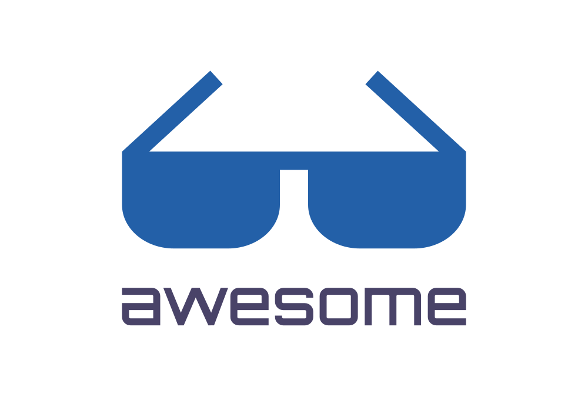

	

> My personal curated list of awesome online resources.

## Contents
- [Design resources](#design-resources)
- [Online tools](#online-tools)

---

### == Design resources ==
- [Freebiesbug](https://freebiesbug.com) - selection of free design resources
- [Unblast](https://unblast.com) - free design resources

#### Colors
- [Adobe Color](https://color.adobe.com) - color palettes creator
- [Color Hunt](https://colorhunt.co) - color inspiration
- [Coolors](https://coolors.co) - color schemes generator
- [Picular](https://picular.co) - color generator using Google's image search
- [Uigradients](https://uigradients.com) - color gradients

#### CSS
- [Gradient magic](https://www.gradientmagic.com) - CSS gradients gallery

#### Fonts
- [Befonts](https://befonts.com) - free, high quality, fonts
- [Dafont](https://www.dafont.com) - archive of freely downloadable fonts
- [Fontjoy](https://fontjoy.com) - font combinations generator
- [FontSpace](https://www.fontspace.com) - free fonts
- [Fontsquirrel](https://www.fontsquirrel.com) - legal, high quality, free fonts

#### Icons
- [Flaticon](https://www.flaticon.com) - free vector icons and stickers
- [Streamline icons](https://app.streamlinehq.com/icons) - icon collections

#### Illustrations
- [Error 404](https://error404.fun) - free illustrations for 404 pages
- [Storyset](https://storyset.com) - free customizable illustrations

### Images
- [Blobmaker](https://www.blobmaker.app) - blob generator --
- [Get waves](https://getwaves.io) - SVG wave generator
- [Hero patterns](https://www.heropatterns.com) - repeatable SVG background patterns collection
- [SVG backgrounds](https://www.svgbackgrounds.com) - customizable SVG-based repeating patterns collection

#### Inspirations
- [Logoinspiration](https://www.logoinspirations.co) - logo inspiration
- [Logopond](https://logopond.com) - inspirational site & showcase

#### Logos
- [Free Logo Design](https://freelogodesign.org) - free logo generator
- [Logocrunch](https://brandmark.io/logo-crunch) - logotype maker
- [Logoipsum](https://logoipsum.com) - free placeholder logos
- [SVG porn](https://svgporn.com) - vector logos
- [World vector logo](https://worldvectorlogo.com) - popular brand SVG logos

### == Online tools ==

#### Animations
- [Keyframes](https://keyframes.app/animate) - keyframes animations generator

#### CSS generators
- [Clippy](https://bennettfeely.com/clippy) - CSS complex shapes generator
- [CSS generator](https://webcode.tools/generators/css) - CSS generator tools
- [Cubic-bezier](https://cubic-bezier.com) - cubic-bezier generator

#### Images
- [Pixlr](https://pixlr.com/editor/) - image editor
- [TinyPGN](https://tinypng.com) - image compressor

#### Other
- [Canva](https://www.canva.com) - graphic design platform
- [Playcode](https://playcode.io) - javascript playground
- [Renderforest](https://www.renderforest.com) - online branding tools
- [Vectr](https://vectr.com) - graphics software
- [VistaCreate](https://create.vista.com) - free graphic designer tool
